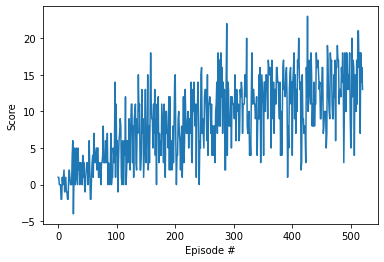

# Project report

## Learning algorithm

The learning algorithm used is vanilla Deep Q Learning as described in original paper. As an input the vector of state is used instead of an image so convolutional neural nework is replaced with deep neural network. Dueling DQN is implemented in the model. Also Prioritized Experience Replay is implemented with SumTree implementation as memory. Double DQN is implemented to make sure we don't overfit. The deep neural network has following layers:

- Fully connected layer - input: 37 (state size) output: 64
- Fully connected layer - input: 64 output 32
- Fully connected layer - input: 32 output: 4(action size)
                        |- input: 32 output: 4(advantage value)
                        |- input: 32 output: 1(state value)

Parameters used in DQN algorithm:

- Maximum steps per episode: 1000
- Starting epsilion: 0.5
- Ending epsilion: 0.01
- Epsilion decay rate: 0.98
- Batch size: 64
- Steps per update: 4
- Gamma: 0.99
- Tau: 0.001
- Learning rate: 0.0005
- Epsilon: 0.01
- alpha: 0.6
- beta: 0.4
- beta increment per sampling: 0.001

## Results



```
Episode 100	Average Score: 2.11
Episode 200	Average Score: 6.60
Episode 300	Average Score: 9.07
Episode 400	Average Score: 11.36
Episode 500	Average Score: 12.57
Episode 521	Average Score: 13.04
Environment solved in 421 episodes!	Average Score: 13.04
```


## Ideas for future work

1. Extensive hyperparameter tuning
2. RAINBOW Paper
3. Learning from pixels
